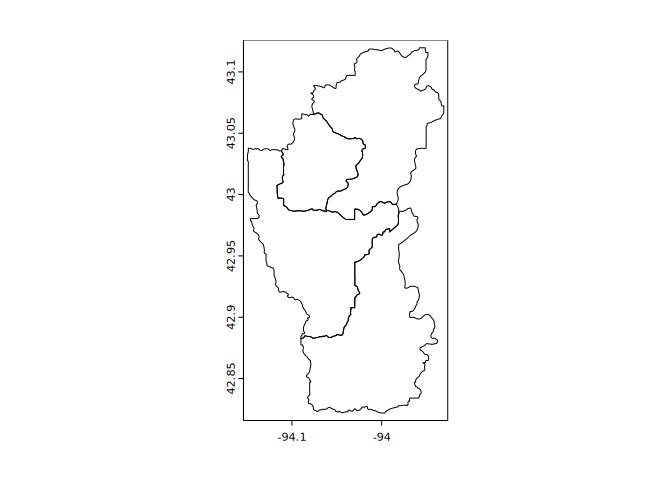
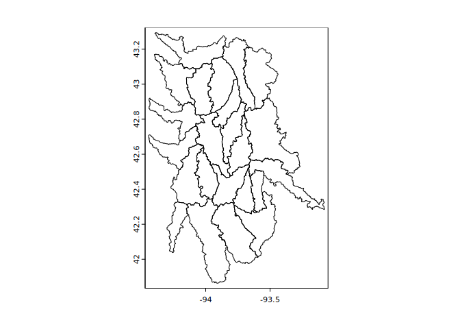
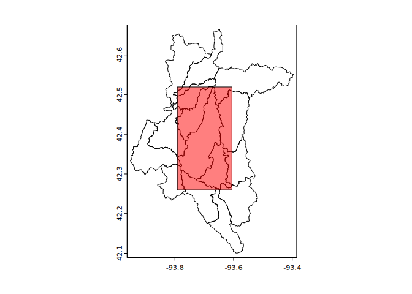

<!-- README.md is generated from README.Rmd. Please edit that file -->

# {huckster}

<!-- badges: start -->

[](https://github.com/brownag/huckster/actions/workflows/R-CMD-check.yaml)
<!-- badges: end -->

The goal of {huckster} is to provide tools for easily obtaining
boundaries of hydrologic units and other information based on Hydrologic
Unit Codes (‘HUC’).

Hydrologic unit data are retrieved from the U.S. Geological Survey
‘NationalMap’ REST API by default. This endpoint can be customized.
<https://hydro.nationalmap.gov/arcgis/rest/services/wbd/MapServer/>.

## Installation

You can install the development version of {huckster} from
[GitHub](https://github.com/brownag/huckster) with:

``` r
# install.packages("remotes")
remotes::install_github("brownag/huckster")
```

## Example

Here are some basic examples showing how to obtain hydrologic unit
boundaries by ID, point, envelope, and polygon.

The default `layerid=5` corresponds to a “10-digit” HUC or “Watershed”
level boundary.

``` r
library(huckster)
library(terra)
#> Warning: package 'terra' was built under R version 4.2.3
#> terra 1.7.29

ids <- c("071000050101",  "071000050102",  "071000050103",  "071000050104")
w <- id_to_huc(ids, layerid = 6)
plot(w)
```



``` r

x <- point_to_huc(-94.0671, 43.026, layerid = 4)
plot(x)
```


``` r

# bounding box/envelope numeric input
y <- envelope_to_huc(terra::ext(x))
plot(y)
```



``` r

# SpatVector polygon ('Ditch Number 71' rect extent) as input
p <- as.polygons(y[1, ], ext = TRUE)
z <- polygon_to_huc(p, layerid = 6)
plot(z)
plot(p, col = rgb(1, 0, 0, 0.5), add = TRUE)
```


